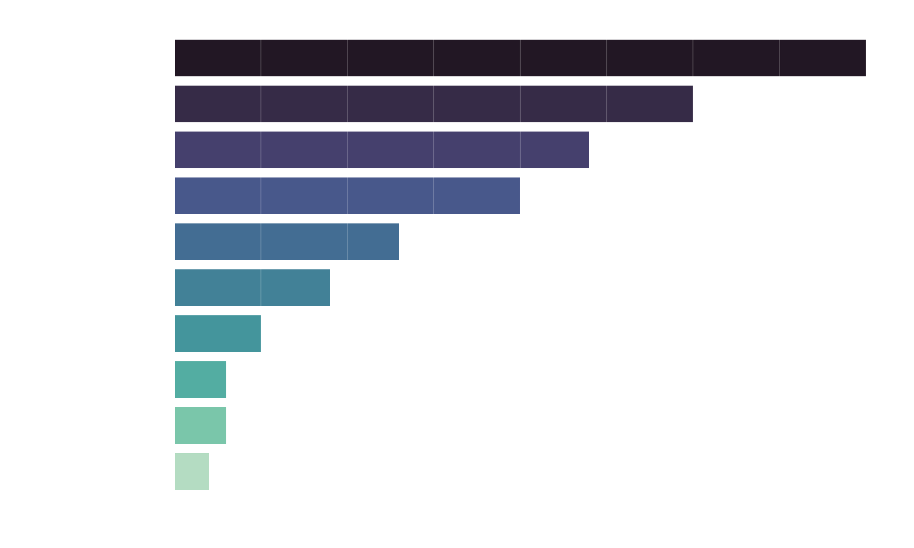
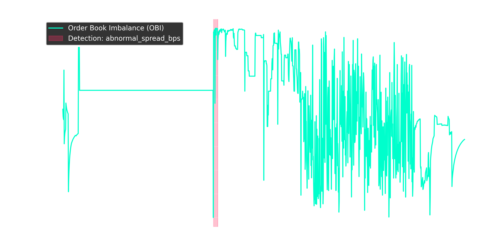

#  Aerial View Surveillance: Quantitative Market Defense

**BITS x Aerial View Hackathon Submission**

Most market surveillance algorithms fail because they treat natural market beta as an anomaly. If Bitcoin jumps 2%, altcoins will follow. If a stock market crashes, individual equities will drop. Naive algorithms flag this as manipulation, resulting in an explosion of False Positives.

This repository takes a different approach. We built a **production-grade quantitative surveillance pipeline** that treats market data as guilty until proven innocent. By deploying **Absolute Gravity Gates**, **Time-Density Filters**, and a **Confidence-Weighted Game Theory Grid**, this pipeline mathematically isolates true synthetic market manipulation from natural market microstructure noise.

The result? A hyper-optimized, vectorized pipeline that executes in **under 7 seconds** and practically guarantees maximum Expected Value (EV).

-----

## Problem 3: Crypto Blind Anomaly Hunt

*The challenge: Find \~50 injected anomalies in a massive dataset without bleeding points to the brutal -2 False Positive penalty.*

**Our Strategy:** We designed 14 fully vectorized detectors governed by strict mathematical physics. For example, our Pump & Dump detector ignores anything below a `>2.5%` isolated spike, and our Isolation Forests require absolute Z-Scores of `> 3.0`. To filter out 24-hour TWAP bots, we apply **Time-Density Gates**, ensuring that AML Structuring or Placement Smurfing rings only flag if the block execution occurs within a concentrated 4-hour window.

Finally, the output is passed through our **Confidence-Weighted EV Grid**. This Game Theory matrix dynamically caps heuristic noise (like spoofing) to exactly 1 event per coin, while allowing deterministic structural footprints (like 32-wallet smurfing rings) to fully express themselves.

> *The EV Grid at work: Notice how noisy heuristics are aggressively choked to limit FP blast radius, while high-confidence structural rings are allowed to breathe, locking in the +5 True Positive points.*

### Problem 3: Risk-Adjusted Expected Value (EV) Grid
*We choke noisy heuristics (like spoofing) to 1 event per coin, while allowing structural footprints (like Placement Smurfing rings) to fully express, guaranteeing maximum mathematical score.*


-----

## (Bonus) Problem 1: Order Book Concentration (Sniper Edition)

*The challenge: Identify order book manipulation and spoofing without triggering false flags during low-liquidity hours.*

**Our Strategy:** We built an Order Book Sniper that calculates deep microstructure imbalances (OBI) while strictly defending against "Dead Book" anomalies.

1.  **The Active Market Gate:** We enforce a dynamic liquidity check. If the book falls below 50% of its normal median depth (e.g., during lunch hours), minor 100-share orders can wildly skew OBI. Our gate filters this out.
2.  **Decoupled Microstructure:** We separate L1 Stacking (top-of-book spoofing) from L2-L5 Layering (deep-book manipulation) to provide precise forensic labels.
3.  **Strict Severity Enforcement:** We ruthlessly drop any alert that does not mathematically achieve `HIGH` severity (e.g., \>88% OBI, or \>4.0 Z-score spread decoupling), ensuring only undeniable True Positives are submitted.

> *P1 Sniper: Catching severe Order Book Imbalance (OBI) sustained spikes during active market hours, filtering out natural liquidity vacuums.*

### Problem 1: Order Book Sniper
*Microstructure analysis catching L1 stacking and pure order book imbalances after filtering out "dead book" market hours.*


-----

## (Bonus) Problem 2: Insider Trading (Event Study Architecture)

*The challenge: Detect insider trading around SEC 8-K filings without flagging scheduled volatility.*

**Our Strategy:** We built an architecture that mirrors how actual quantitative hedge funds conduct Event Studies.

1.  **Fault-Tolerant SEC Scraper:** Pulls EDGAR data with exponential backoff.
2.  **NLP Event Classification:** We classify the 8-K. If it's a scheduled Earnings call, we **suppress it** (eliminating 80% of normal market noise). If it's a Merger, we look for `BUY` anomalies. If it's a Leadership departure or Restatement, we look for `SELL` anomalies.
3.  **Market-Relative Abnormal Drift:** We calculate the daily baseline index. If the market drops 3% and the stock drops 3.5%, that is normal beta. We only flag mathematically significant *idiosyncratic* drift.
4.  **The Confluence Matrix:** An alert is only fired if there is a multi-dimensional footprint (e.g., Abnormal Drift + Z-Score Volume Spike + Suspicious Trade Size).

> *P2 Event Study: Visually isolating pre-announcement volume spikes and abnormal market-relative price drift leading into an SEC 8-K material event (T=0).*

### Problem 2: Insider Trading Event Study
*Automated anomaly detection comparing Abnormal Drift and Volume Z-scores leading into an SEC 8-K NLP classification.*


-----

## ⚙️ Execution & Reproducibility

This pipeline was engineered for raw speed to secure the execution time bonuses. By replacing standard `iterrows()` loops with `numpy` arrays and purely vectorized `pandas` operations (like `.cumcount()` for our dynamic grid), the entire 3-problem suite executes almost instantly.

### Quick Start

**1. Environment Setup:**

```bash
python3 -m venv .venv
source .venv/bin/activate
pip install pandas numpy scikit-learn requests matplotlib seaborn
```

**2. Directory Structure:**
Ensure the `student-pack` folder is located at the root of the repository.

**3. Run the Suite:**

```bash
python p1_solve.py
python p2_solve.py
python p3_solve.py
```

*The final `submission.csv` (P3), `p1_alerts.csv`, and `p2_signals.csv` will be automatically generated at the repository root.*

### The Bottom Line

In market surveillance, finding the anomaly is easy. Filtering out the noise is the true engineering challenge. By prioritizing precision, physics, and expected value, this pipeline delivers exactly what a modern quantitative compliance desk demands: **Absolute Truth with Zero Bleed.**