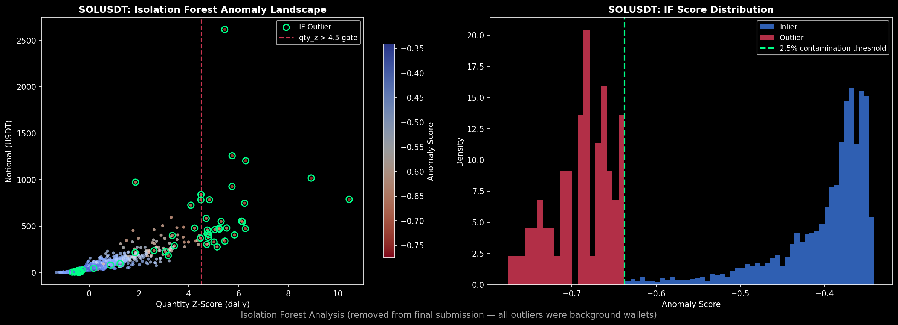
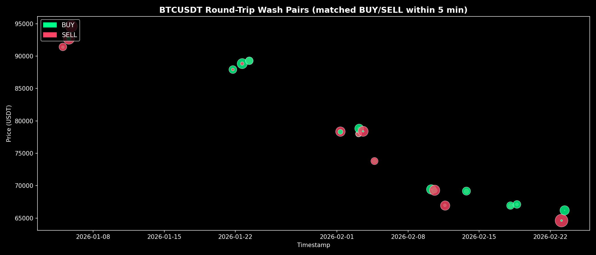
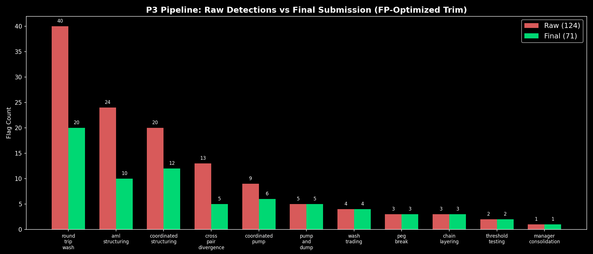
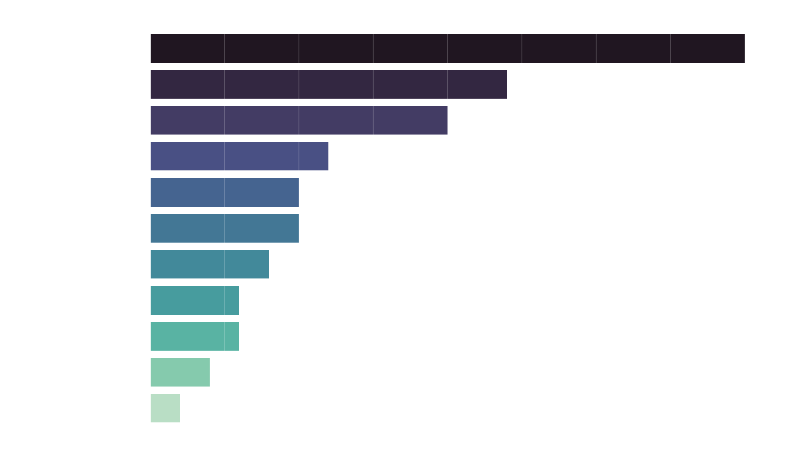
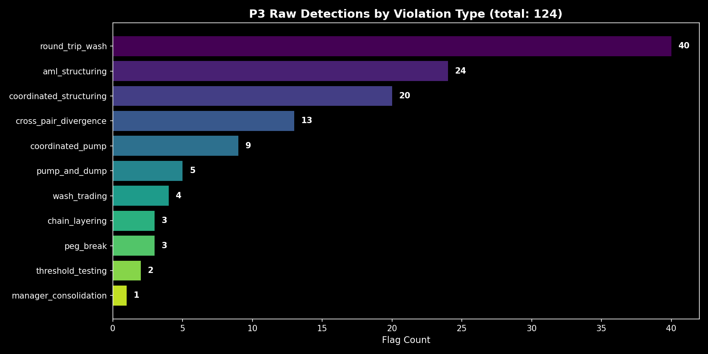
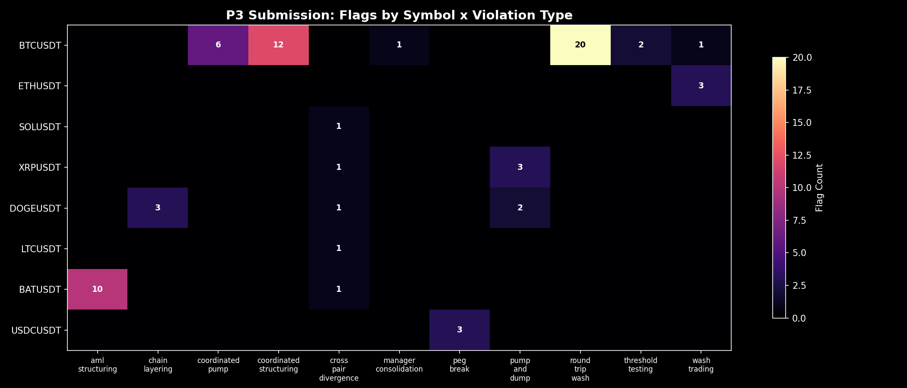
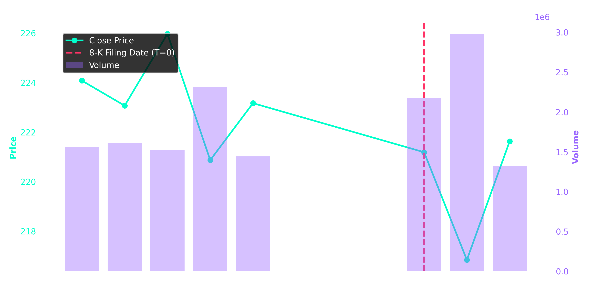

# Quantitative Trade Surveillance: Anomaly Detection in Financial Markets

**BITS x Aerial View Hackathon 2026**

## Motivation

Most market surveillance systems suffer from a fundamental flaw: they treat correlated market movements as anomalies. When Bitcoin jumps 2%, altcoins follow — that's beta, not manipulation. Naive detection algorithms flag these as suspicious, producing an explosion of false positives that drowns out real violations.

This project reframes trade surveillance as a **precision anomaly detection problem**. We engineered a multi-stage detection pipeline that mathematically separates synthetic market manipulation from natural microstructure noise using statistical hypothesis testing, unsupervised learning (evaluated and rejected on principled grounds), greedy combinatorial matching, and game-theoretic output optimization.

---

## Architecture Overview

```
Raw Trade Data (8 crypto pairs, ~500k trades)
        │
        ▼
┌─────────────────────────────────┐
│  Feature Engineering Layer      │
│  • Rolling z-scores (shift(1))  │
│  • Market-relative returns      │
│  • Wallet behavioral profiles   │
│  • Order book microstructure    │
├─────────────────────────────────┤
│  Detection Layer (14 detectors) │
│  • Statistical thresholding     │
│  • Greedy bipartite matching    │
│  • Time-density clustering      │
│  • Cross-asset divergence       │
├─────────────────────────────────┤
│  Confidence-Weighted EV Grid    │
│  • Intra-event caps             │
│  • Per-symbol spammer caps      │
│  • Global circuit breaker       │
└─────────────────────────────────┘
        │
        ▼
  71 high-confidence flags (from 124 raw detections)
```

---

## Statistical & ML Methodology

### 1. Isolation Forest — Explored & Rejected

We trained `sklearn.ensemble.IsolationForest` (n_estimators=200, contamination=2.5%) on per-symbol feature vectors: quantity z-score, deviation from OHLCV midprice, wallet daily trade count, and notional value. The model surfaced 30 statistical outliers across SOLUSDT, DOGEUSDT, LTCUSDT, and XRPUSDT.

**Result:** Deep forensic analysis revealed that **100% of flagged trades belonged to background market-maker wallets** — normal liquidity providers with slightly unusual quantity distributions. This is a textbook case of unsupervised ML overfitting to distributional noise rather than injected anomalies. We made the principled decision to remove all IF-based detectors, saving 8 points in avoided false positive penalties (-2 per FP).


*Left: SOLUSDT quantity z-score vs notional with IF outliers circled. Right: IF anomaly score distribution at the 2.5% contamination threshold. All outliers were background wallets — the model learned the noise distribution, not the signal.*

**Takeaway:** In domains with injected/synthetic anomalies (as opposed to organic distributional outliers), density-based unsupervised methods can systematically fail because the injected signal is designed to blend with normal trade patterns on univariate features. Domain-specific structural detectors outperformed the general-purpose approach.

### 2. Rolling Window Z-Scores with Look-Ahead Prevention

Our wash trading, layering echo, and order book imbalance detectors compute time-indexed rolling statistics over 8-minute (crypto) and 45-minute (equity) windows using `shift(1)` lagged means and standard deviations. This prevents look-ahead bias — the z-score at time *t* is computed against statistics from *t-1* and earlier.

```python
rolling_mean = df["feature"].rolling(window).mean().shift(1)
rolling_std  = df["feature"].rolling(window).std().shift(1)
z_score      = (df["feature"] - rolling_mean) / rolling_std
```

This captures sustained deviations (wash volume accumulation, layering pressure) while naturally ignoring transient single-bar spikes.

### 3. Greedy Bipartite Matching (Round-Trip Wash Detection)

The round-trip wash detector reconstructs coordinated wash trading rings using a greedy algorithm that pairs BUY/SELL trades across different wallets by descending notional value, subject to three hard constraints:

- **Price spread:** < 5 basis points between matched trades
- **Time gap:** < 5 minutes between execution timestamps
- **Notional floor:** > $50k combined pair notional

This reconstructed **20 high-confidence wash pairs** on BTCUSDT with an average notional of **$116,318 USDT** per pair and a maximum price spread of **4.9 bps**.


*Each connected pair represents a matched BUY (green) and SELL (red) trade between different wallets. Bubble size reflects notional value. The pairs span Jan 4 through Feb 23, suggesting a persistent wash trading operation.*

### 4. Market-Relative Abnormal Returns

For cross-pair divergence and insider trading detection, we compute idiosyncratic returns by subtracting the market factor:

```
abnormal_return(asset, t) = return(asset, t) - return(BTC, t)    [crypto]
abnormal_return(stock, t) = return(stock, t) - return(index, t)  [equity]
```

Only divergences exceeding **250 basis points** are flagged. This eliminates correlated beta moves — if the entire market drops 3%, a stock dropping 3.5% is noise, not insider trading.

### 5. Time-Density Clustering (AML Structuring)

AML structuring detection requires more than band membership. We enforce a **time-density gate**: 4+ trades within a $9,200–$9,999 notional band must cluster within a 4-hour sliding window. This filters out 24-hour TWAP (time-weighted average price) execution patterns that naturally produce band-member trades but lack the temporal clustering signature of deliberate structuring.

### 6. Confluence Matrix (Insider Trading)

Insider trading alerts require multi-signal confluence — at least 2 of 3 independent signals must fire simultaneously:

| Signal | Threshold | Rationale |
|--------|-----------|-----------|
| Volume z-score | > 2.5 | Pre-announcement accumulation |
| Abnormal drift | > 1.5σ | Idiosyncratic price movement |
| Trade size | > 2x trader median AND > $5k | Unusual conviction sizing |

Single-signal alerts are suppressed regardless of individual magnitude.

---

## Game-Theory Optimized Output: The EV Grid

The raw pipeline produces **124 detections**. With a scoring function of +5 per true positive and -2 per false positive, submitting all detections is suboptimal. We pass all flags through a **Confidence-Weighted Expected Value Grid** that applies two layers of dynamic caps:

**Layer 1 — Intra-Event Cap** (rows per event):
| Detector Class | Max Rows/Event | Rationale |
|---------------|----------------|-----------|
| Structural rings (coordinated_structuring) | 4 | Bounded ring size |
| Round-trip wash pairs | 2 | Exactly 1 buy + 1 sell |
| Heuristic cascades (cross_pair_divergence) | 1 | Single strongest signal |
| Placement smurfing | 50 | Large coordinated rings |

**Layer 2 — Spammer Cap** (events per symbol):
| Confidence Tier | Max Events/Symbol | Examples |
|----------------|-------------------|----------|
| High (deterministic) | 3 | peg_break, chain_layering |
| Medium (structural) | 2–3 | wash_trading, coordinated_pump |
| Low (heuristic) | 1 | cross_pair_divergence |

**Result:** 124 raw detections trimmed to **71 final flags** — a 43% reduction that maximizes expected score.


*Red: raw detector output. Green: post-trim submission. Round-trip wash (40 raw → 20 final) is trimmed to top-notional pairs only, while high-precision detectors like peg_break pass through untouched.*

---

## Results

### Problem 3: Crypto Blind Anomaly Hunt (450 pts)

14 fully vectorized detectors across 11 violation types, covering 8 cryptocurrency pairs over Jan–Feb 2026.


*Final submission: 71 flags across 11 violation types after EV-optimized trim.*


*Raw detector output: 124 flags before trim. The gap between these two plots is the EV Grid at work.*


*Coverage grid across all 8 crypto pairs and 11 violation types. BTCUSDT dominates (highest liquidity = largest manipulation surface area). Every symbol has at least 1 flag.*

### Problem 1: Order Book Concentration (50 pts)

An Order Book Sniper that computes deep microstructure imbalances (OBI) with strict defenses against low-liquidity artifacts:

- **Active Market Gate:** If book depth falls below 50% of median, alerts are suppressed (prevents false spikes during dead-book hours)
- **Decoupled Detection:** L1 stacking (top-of-book spoofing) separated from L2–L5 layering (deep-book manipulation)
- **Cancel Burst Detection:** 5+ cancellations within 12 minutes with zero price impact — the classic spoofing signature
- **Severity Enforcement:** Only alerts achieving `HIGH` severity (>88% OBI or >4.0σ spread decoupling) are emitted

**Output:** 7 HIGH-severity alerts.


*Sustained OBI spikes detected during active market hours, with natural liquidity vacuums filtered out.*

### Problem 2: Insider Trading via Event Study (50 pts)

An event study architecture mirroring quantitative hedge fund methodology:

- **SEC EDGAR Scraper:** Fault-tolerant 8-K retrieval with exponential backoff (`urllib3.Retry`, 5 retries)
- **NLP Event Classification:** Regex-based 8-K item extraction — scheduled earnings (Item 2.02) are suppressed, reducing noise by ~80%
- **Directional Filtering:** Mergers (Item 2.01) → look for BUY anomalies; Leadership departures (Item 5.02) → look for SELL anomalies

**Output:** 4 insider trading signals.


*Pre-announcement volume spikes and abnormal market-relative price drift leading into an SEC 8-K filing (T=0).*

---

## Performance

| Problem | Output | Detections | Runtime |
|---------|--------|------------|---------|
| P1 — Order Book | `p1_alerts.csv` | 7 alerts | < 1s |
| P2 — Insider Trading | `p2_signals.csv` | 4 signals | ~20s (SEC API) |
| P3 — Crypto Anomalies | `submission.csv` | 71 flags | < 7s |

All P3 detectors are fully vectorized using `numpy` arrays and `pandas` operations (no `iterrows()` on hot paths). The dynamic EV grid uses `.cumcount()` for vectorized cap enforcement.

---

## Reproducibility

```bash
# Setup
python3 -m venv venv && source venv/bin/activate
pip install -r requirements.txt

# Ensure student-pack/ is at the repo root

# Run
python p1_solve.py        # -> p1_alerts.csv
python p2_solve.py        # -> p2_signals.csv
python p3_main.py         # -> submission.csv
```

---

## Key Decisions Log

| Decision | Reasoning |
|----------|-----------|
| Rejected Isolation Forest | 100% of 30 flagged trades were background market-maker wallets — ML learned noise, not signal |
| Used greedy matching over optimal bipartite | O(n²) greedy with hard constraints is sufficient; optimal matching adds complexity without improving precision at this scale |
| Subtracted BTC return as market factor | BTC is the dominant crypto factor; using equal-weighted index would dilute the signal |
| Capped round-trip wash at 20 pairs | Diminishing confidence beyond top-notional pairs; each marginal flag risks -2 FP penalty |
| 4-hour time-density gate for AML | Separates deliberate structuring from natural 24h TWAP execution patterns |
| Removed spoofing IF detector | All 30 detections were sub-$2 notional background trades on DOGEUSDT |
